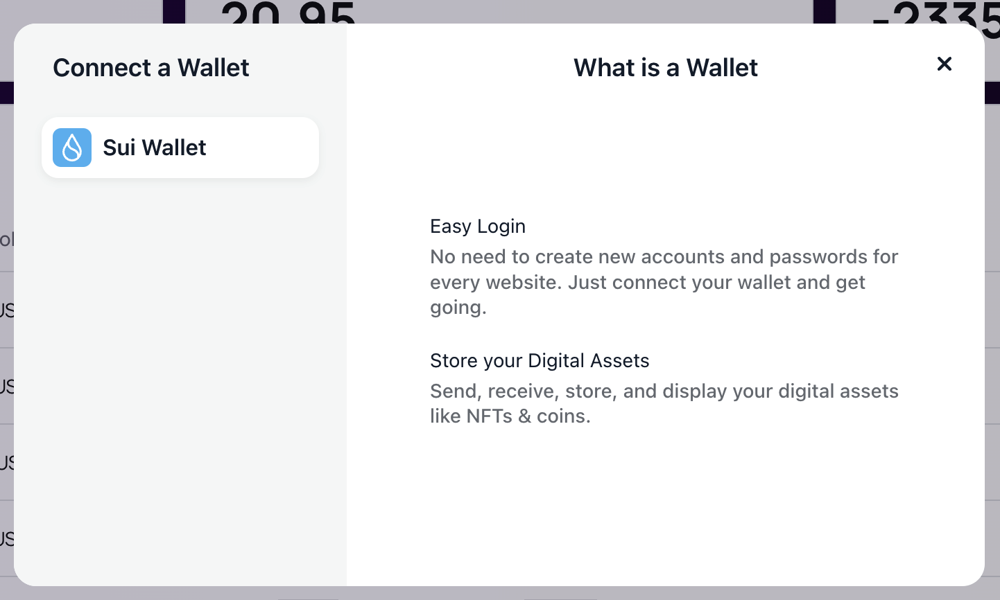

# StaPay - Decentralized Crowdfunding Platform

Welcome to StaPay, a decentralized crowdfunding platform powered by the Ethereum blockchain and React.js. StaPay enables users to initiate and support innovative projects, invest in existing ventures, and secure funding through the utilization of smart contracts.

## Table of Contents
- [Introduction](#introduction)
- [Key Features](#key-features)
- [Getting Started](#getting-started)
- [Usage](#usage)
- [Contributing](#contributing)
- [License](#license)

## Introduction

StaPay revolutionizes the crowdfunding experience by leveraging blockchain technology. With StaPay, you can explore a decentralized ecosystem where trust and transparency are paramount. By harnessing the power of smart contracts, StaPay ensures that funds are securely managed, project milestones are met, and backers are protected.

## Live Demo
- Test the Application at: [Live Demo](https://stapay-dapp.vercel.app/)

## Key Features

- **Decentralized Funding**: Utilize Ethereum's blockchain to decentralize the crowdfunding process, eliminating intermediaries and reducing fees.

- **Project Creation**: Seamlessly create new projects, set funding goals, and outline project details with ease.

- **Investment Opportunities**: Discover a wide range of exciting projects to invest in, supporting innovative ideas and entrepreneurs.

- **Smart Contracts**: Smart contracts automate fund distribution, ensuring that project creators receive funds when milestones are achieved, and backers are protected.

- **Transparency**: Transparent project updates and financial records are stored on the blockchain for public scrutiny.

- **User-Friendly Interface**: An intuitive React.js frontend ensures a smooth and enjoyable user experience.

## ScreenShot

## Contact

- **Author**: Harsh Agrawal & Venky Kumar

- **`GitHub`**: [harshagrawal2503](https://github.com/harshagrawal2503)
- **`GitHub`**: [BoddepallyVenkatesh06](https://github.com/BoddepallyVenkatesh06)

For any inquiries or support, please get in touch with me through GitHub
